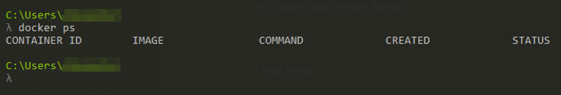

# DOCKER SETUP FOR EXISTING WORDPRESS PROJECT

This is a guide on how to set up an existing WordPress project for local development with docker

## 1: Download and run Docker

First, visit the Docker website and look for the Get Docker tab. Download and install. You might need to restart your computer after instalation. Once it is installed you can type in 
```bash
docker ps
```
inside of your terminal and if everything went right you should see something like this: 


## 2: Clone your project repository

First create a project folder and open your code editor inside of it. Then open integrated terminal (ctrl + `) and type 
```bash
git clone https://github.com/git_account/repo_name
```
navigate to the 'wordpress' directory 

## 3: Add Docker setup files

- Inside of the WordPress directory paste docker-compose.yml, and .env files and schema directory.
- Place your database .sql file inside of the schema directory.
- Change database name in docker-compose.yml file to your database name.
 
## 4: Update .sql file

- In your database (./schema/someDatabase.sql) file search for wp_options table and change values of 'siteurl' and 'home' from your website address to 'http://localhost:8080' 
   
## 5: Run docker-compose up 

Open terminal inside of your wordpress directory and run 
```bash
docker-compose up
```

 If you made a typo in any of the previous steps, you will have to kill the process and run 
```bash
docker-compose down -v
```

## 6: Start Wordpress from database

- Go to localhost:8080, choose language and login using following details (specified in .env file)
  
- Database Name: wordpress
- Username: wp_user
- Password: wp_password
- Database Host: db
- Table Prefix: wp_

## 7: Login to wordpress using your credentials 

## 8: Install Packages

- Navigate your theme folder (./wp-content/themes/your_theme) and node modules using 
```bash   
npm i
```

## 9: Update browserSync

Inside of your theme directory open gulpfile.js, find syncOpts object and modify value of proxy to 'localhost:8080'


## 10: Run gulp
Run 
```bash
gulp watch
```

... and enjoy development
